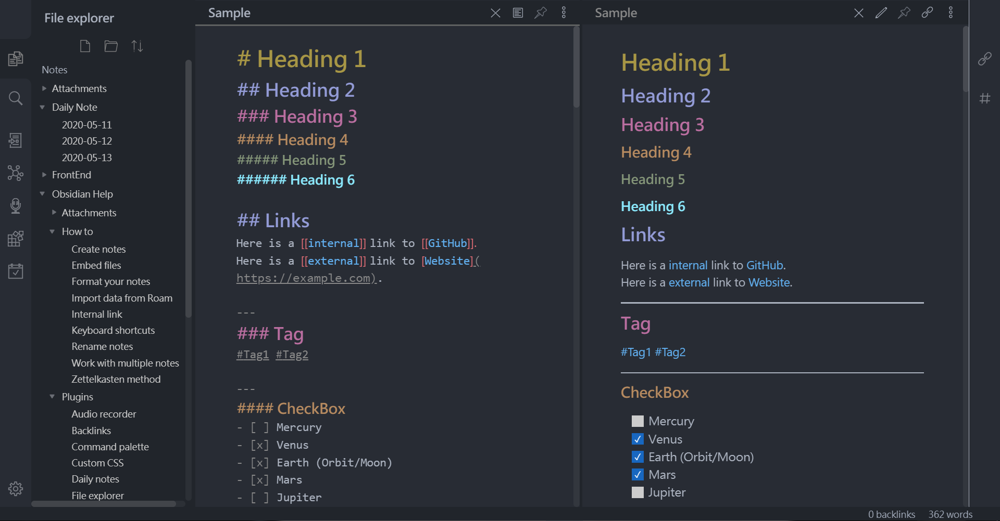
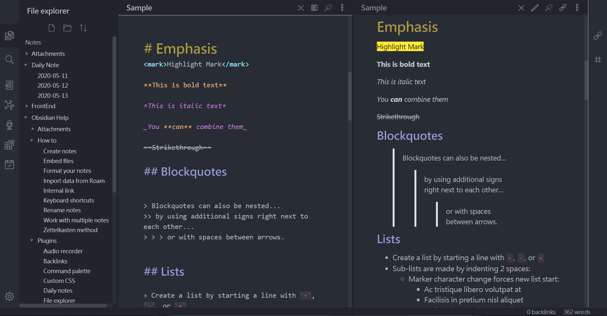

# OneDark Theme for Obsidian

This theme is based [One Dark Pro](https://github.com/Binaryify/OneDark-Pro). And One Dark Pro is based on Atom's default One Dark theme.

Currently only support **Dark mode**.\
Please use the `obsidian.css`\
`obsidian-base.css` is the base css extracted from Obsidian.
- Dark Mode

